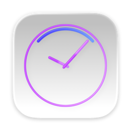
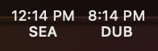
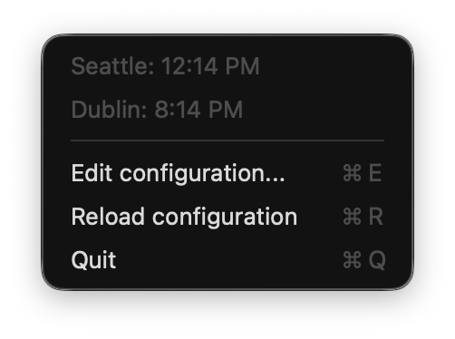

# MenuClock



A configurable world clock in the menu bar. Mostly coded by AI, with human curation and guidance on what to build.




## Features

- Displays current time for multiple time zones (configurable)
- Lives in the macOS menu bar
- Fully configurable via YAML file
- Customizable labels, time zones, and time formats
- Adjustable update interval

## Configuration

The app reads from `~/Library/Application Support/MenuClock/config.yaml` following standard macOS conventions. Example configuration:

```yaml
clocks:
  - label: Seattle
    shortLabel: SEA
    timeZone: America/Los_Angeles
    format: h:mm a
  - label: Dublin
    shortLabel: DUB
    timeZone: Europe/Dublin
    format: h:mm a
    display: menubar
  - label: Hyderabad
    shortLabel: HYD
    timeZone: Asia/Kolkata
    format: h:mm a
    display: menu
updateInterval: 10
runAtStartup: false
```

### Configuration Options

#### Clocks

Each entry under clock may have these options:

- `label`: Full name shown in the dropdown menu
- `shortLabel`: Abbreviated name shown in the menu bar
- `timeZone`: IANA time zone identifier (e.g., "America/New_York", "Asia/Tokyo")
- `format`: Time format using [Unicode date format patterns](https://www.unicode.org/reports/tr35/tr35-dates.html#Date_Field_Symbol_Table)
  - `HH:mm` - 24-hour format (13:45)
  - `hh:mm a` - 12-hour format with AM/PM (01:45 PM)
  - `HH:mm:ss` - 24-hour with seconds (13:45:30)
- `display`: Where this clock should show up: `menu`, `menubar`, or `both` (default: `both`)

#### Global options

- `updateInterval`: Seconds between updates (default: 10.0)
- `runAtStartup`: Whether to register the app to run at startup or not (default: false)

## Building and Running

1. Make sure you have Xcode installed (includes Swift compiler)

2. Build the application:
   ```bash
   swift build -c release
   ```

   Or use the packaging script to create a complete app bundle:
   ```bash
   ./package.sh
   ```

3. (Optional) Set up your configuration:
   ```bash
   mkdir -p ~/Library/Application\ Support/MenuClock
   cp example.config.yaml ~/Library/Application\ Support/MenuClock/config.yaml
   ```
   
   If you don't create a config file, the app will create a default one with Seattle and Dublin time zones.

4. Run the application:
   ```bash
   .build/release/MenuClock
   ```

5. The clock will appear in your menu bar with configured times. Click on it to see a dropdown with individual times and a Quit option.

## Adding More Locations

Edit `~/Library/Application Support/MenuClock/config.yaml` and add more clock entries. You can find IANA time zone identifiers [on Wikipedia](https://en.wikipedia.org/wiki/List_of_tz_database_time_zones).

After editing the config, restart MenuClock or use the "reload configuration" option for changes to take effect.

## How It Works

The app uses:
- `NSStatusItem` to create a menu bar item
- `Timer` to update times based on configured interval
- `TimeZone` and `DateFormatter` to display times in different time zones
- `NSApplication` with `.accessory` activation policy to hide the dock icon
- YAML configuration for flexible customization

## Development

### Rebuilding the App Icon

The app icon is pre-built and checked into the repository at `Sources/MenuClock/Resources/icon/built/`. This avoids the expensive icon compilation step during normal packaging.

If you need to rebuild the icon (e.g., after updating the source SVG or AppIcon.icon assets):

```bash
./build-icon.sh
```

This will regenerate the `AppIcon.icns` and `Assets.car` files. Commit these changes if the icon has been updated.